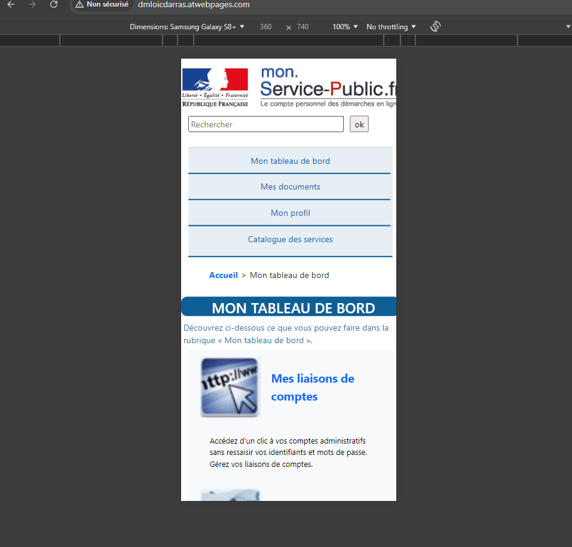
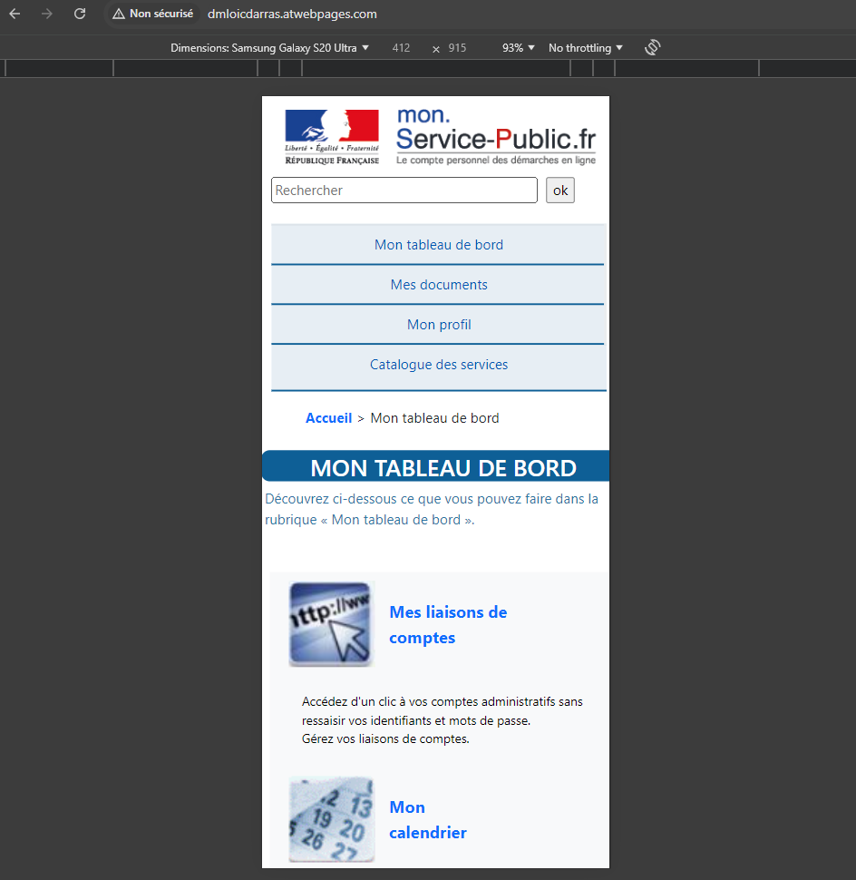

# Compte Rendu du devoir "Devoir à la maison à rendre sur un hébergement (GitHub Pages/ Heroku/ Alwaysdata/ ...)
### Devoir de Loïc Darras (2024 - Lience Professionnelle Projet Web et Mobile CFA des Sciences / Sorbonne Université)

* Lien du dépôt de l'adresse de la page : http://dmloicdarras.atwebpages.com/

* Le compte rendu et le code est aussi disponible sur le dépôt github suivant : https://github.com/loicD77/responsiveHTML-CSS-Bootstrap-L3_Pro/tree/master


## Table des matières
- [Résumé](#résumé)
  - [Description du projet](#description-du-projet)
  - [Structure de la page](#structure-de-la-page)
- [Les plateformes et logiciels utilisés](#les-plateformes-et-logiciels-utilisés)
  - [Editeur de texte](#éditeur-de-texte)
- [Le code HTML](#le-code-html)
  - [A) Les balises link](#a-les-balises-link)
  - [B) Les balises scripts de Bootstrap](#b-les-balises-scripts-de-bootstrap)
  - [C) DOCTYPE et langue](#c-doctype-et-langue)
  - [D) En-tête (head)](#d-en-tête-head)
  - [E) Header (Logo du site, barre de recherche)](#e-header-logo-du-site-barre-de-recherche)
  - [F) Nav (Barre de navigation)](#f-nav-barre-de-navigation)
  - [G) Fil d'Ariane](#g-fil-dariane)
- [Le CSS](#le-css)
- [Conclusion](#conclusion)


# Résumé

## Description
 * Ce projet a pour objectif de recréer une page web à partir d'une capture d'écran. La page suit une structure sémantique avec des menus surgissants, des articles et un aside pour les astuces et actualités. La page est responsive (du mieux possible avec le niveau que l'étudiant possède actuellement pour le délai déterminé) grâce à des media queries et à la grille Bootstrap pour la pagination.
 * J'ai essayé de choisir des noms de classes correct (en anglais)

 * J'avais de base des connaissances en HTML/CCS mais je suis encore loin d'être l'expert idéal dans ce domaine... (Comme par exemple en CSS la différence entre une pseudo-classe et un pseudo-élément qui n'était plus très clair, ou encore ou encore les frères immédiats, frères suivants au même niveau etc..)
 * Il est vrai que je me suis aidé de Chatgbt pour structurer le code et créé ce compte-rendu, mais j'ai essayé de le faire de manière intelligente, en lui demandant seulement les choses dont je ne comprenais pas et encore, même lui avait des difficultés à faire ce que je voulais faire...
 * J'aurai dû utilisé plus efficacement les 3 semaines "sans-alternance", malgré que j'ai écris un cahier entier de 96 page avec pleins de compétences css (et un autre que j'utilise pour des nouvelles choses) je n'ai pas était au mieux que j'aurai pu faire, j'aurai dû me concentrer davantage sur Bootstrap (flexbox, grille) car j'ai actuellment encore des difficultés à comprendre la logique de ce framework, par manque de pratique et d'utilisation idéale de mon temps .

 * J'ai également utilisé la documentation HTML de **Mozilla** (https://developer.mozilla.org/en-US/docs/Web/HTML) ainsi que sa documentation CSS (https://developer.mozilla.org/en-US/docs/Web/CSS)

 * Je me aussi aidé du cours html/css de openclassrooms (https://openclassrooms.com/fr/courses/1603881-creez-votre-site-web-avec-html5-et-css3)

* J'ai eu un gros problème avec les noms de classes "tdb" et "dec", je voulais remplacer leurs noms par "dashboard-title" et "presentation-title" mais impossible car le style css ne se reflétait pas (même si je modifiais le nom des classes dans le fichier style.css, ou que je vidais le cache du navigateur ou que je changeais d'ordinateurs), je n'ai toujours pas compris actuellement l'origine du problème

## Structure de la page
La page est organisée comme suit :
- Un header avec un menu de navigation
- Un aside à gauche pour "LES ASTUCES" et "LES ACTUALITÉS"
- Une section principale avec des articles
- Un footer avec des liens supplémentaires


# Les plateformes et logiciels utilisés

## Editeur de texte

 * J'ai utilisé l'éditeur de texte générique Sublime Text (codé en C++ et Python) pour réalisé l'entiereté du code de mon projet en html/css à l'aide du framework css Bootsrap

 * Cependant j'ai utilisé Visual Studio Code pour réalisé ce compte rendu avec un fichier "README.md" pour la prévisualisation.

 
 
 ## Style pour les éléments de menu


# Le code HTML

## A) Les balises link


* Dans mon projet, ces balises permettent d'intégrer bootsrap et le fichier css.

* Plus précisément vers la **version 5.3.0** de **Bootstrap** (bibliothèque CSS populaire pour créer des interfaces web responsives et modernes)

* Ici, cdn.jsdelivr.net est un **Content Delivery Network (CDN)** qui fourni des fichiers de manière presque instantanée (très rapide) et de bonne qualité à l'aide divers serveurs dans différents endroits en terme de géographies .


## B) Les balises scripts de Bootstrap

* Rappelons que les balises scripts permettent ici d'inclure des scripts JS (**JavaScript**).

* Ici le code interagit avec le contenu de la page, manipule des éléments et ajoute des fonctionnalités dynamiques.

1. Premier cas de la balise script

```html
<script src="https://cdn.jsdelivr.net/npm/@popperjs/core@2.11.6/dist/umd/popper.min.js"></script>

```


* Ici Popper.js est une bibliothèque JavaScript qui s'occupe des éléments de positionnement, comme les **tooltips** (infobulles) et les **popovers** (ou dropdowns) . Cette incroyable bibliothèque est parfois utilisé avec Bootstrap pour gérer la position de certains composants de l'interface utilisateur.Cela assure que ces éléments s'afficheront correctement par rapport à leurs **éléments déclenchers**, même lorsque la taille de la fenêtre change ou lorsque l'utilisateur fait défiler la page. 
*Cela nous arrange très bien pour notre page web sur les différentes pages webs gérées par **les medias queries***


* Le fichier **poper.min.js** est une version de la bibliothèque dont la taille a était réduite, ce qui donne un chargement plus rapide.

* Dans notre cas le lien pointe vers la version **2.11.6** de Popper.js .


2. Deuxième cas de la balise script :


```html
 <script src="https://cdn.jsdelivr.net/npm/bootstrap@5.3.0/dist/js/bootstrap.min.js"></script>
 ```


* Ici cette ligne inclut la bibliothèque JavaScript de Bootstrap (version 5.3.0)

* Bootstrap a des composants interactifs qui nécessitent JavaScript pour fonctionner (*carrousels, dropdowns, carrousels..*) Ce fichier fournit la logique JavaScript nécessaire pour ces composants .

* Le fichier **bootstrap.min.js** est aussi une réduction.

## C) DOCTYPE et langue


```html
<!DOCTYPE html>
<html lang="fr">
 ```

 * Ici la déclaration **!DOCTYPE HTML** spécialise la catégorie de document et donne des détails pour les différents navigateurs (Ici HTML5 !) 
 * L'attribut **lang="fr"** nous informe que le contenu est en français =.


 ## D) En-tête (head)

```html
<head>
    <meta charset="utf-8">  
    <meta name="viewport" content="width=device-width, initial-scale=1">
    <title>Devoir à la maison</title>
    <link href="https://cdn.jsdelivr.net/npm/bootstrap@5.3.0/dist/css/bootstrap.min.css" rel="stylesheet">
    <link rel="stylesheet" href="style.css">
</head>

 ```

 ### Explications en détails :


 * **meta charset="utf-8"** : ceci définit l'encodage des caractères en UTF-8.

 * **meta name ="viewport"** : assure que le site est responsive sur différents appareils. 

* **title** : spécifie le titre de la page affiché dans l'onglet du navigateur.

* Les liens vers les fichiers **CSS Bootstrap** et un fichier CSS personnalisé (**style.css**) sont compris pour le style .


## E) Header (Logo du site, barre de recherche..)


```html
    <header class=" container d-flex justify-content-between align-items-center py-3"> <!-- En-tête avec flexbox pour l'alignement -->
           
                 <!-- Logo de l'application -->

                <form action="https://mon.service-public.fr/portail/faces/jsp/liste_res_tout.jsp" method="get">  <!-- Formulaire de recherche -->
                    <input type="text" name="fullText" id="rechercheInput" placeholder="Rechercher" title="Rechercher"> <!-- Champ de saisie pour la recherche -->
                    <input type="submit" value="ok" title="Lancer la recherche" id="ok_recherche"> <!-- Bouton d'envoi du formulaire -->
                </form>
             
        </header>

 ```

 * Ici le html concerne les logos et la barre de recherche avec le bouton "ok" à l'aide de **type="submit"**
 * La balise "*header*" est **une balise sémantique utilisée pour définir une section d'en-tête pour un document ou une section.** Dans ce cas, elle contient le logo et le formulaire de recherche de l'application.
* **Attribut class="container d-flex justify-content-between align-items-center py-3"
container**: Il s'agit d'une classe CSS issue de Bootstrap qui crée une mise en page fluide et bien alignée à l'intérieur de l'en-tête, centrant et espaçant correctement le contenu.
* **d-flex :** Cette classe active Flexbox pour cet élément, transformant l'en-tête en un conteneur flex, ce qui permet d'organiser facilement les éléments à l'intérieur (comme le logo et le formulaire).
* **justify-content-between :** Classe Bootstrap qui utilise les fonctionnalités de Flexbox pour espacer les éléments enfants de l'en-tête de manière à les aligner aux extrémités (l'un à gauche, l'autre à droite). *Par exemple, le logo sera à gauche et le formulaire à droite.*
* **align-items-center :** Cette classe aligne verticalement les éléments flex (logo et formulaire) au centre du conteneur flex, garantissant un alignement centré en hauteur.
* **py-3 :** Une autre classe Bootstrap qui applique une marge interne (padding) de 3 unités en haut et en bas de l'en-tête, augmentant l'espacement vertical à l'intérieur.
* **img :** Cette balise insère une image, qui ici représente le logo de l'application.
* **class="french-logo"** : Classe CSS personnalisée utilisée pour styliser l'image (par exemple, pour ajuster la taille ou l'espacement).
* **src="img/logo_msp_Part.png" :** Attribut qui spécifie le chemin d'accès à l'image. Ici, l'image est stockée dans le dossier img sous le nom logo_msp_Part.png.
* **width="365" height="73" :** Ces attributs définissent la largeur et la hauteur de l'image en pixels, ici 365 px de large et 73 px de haut.
* **alt="Logo" :** Texte alternatif qui s'affiche si l'image ne peut pas être chargée, utile pour l'accessibilité et pour les moteurs de recherche.
* **Balise form :** Cette balise contient le formulaire de recherche. Lorsqu'un utilisateur soumet une requête, ce formulaire envoie les données à l'URL spécifiée par l'attribut action.
* **action="https://mon.service-public.fr/portail/faces/jsp/liste_res_tout.jsp" :**  L'URL où les données du formulaire sont envoyées pour traitement. Dans ce cas, il s'agit d'une page sur un site du service public.
* **method="get" :** Indique la méthode HTTP utilisée pour soumettre le formulaire. Ici, get signifie que les données du formulaire seront envoyées en tant que paramètres de l'URL (visibles dans la barre d'adresse).
* **Balise input type="text" :**
Cette balise représente un champ de saisie pour que l'utilisateur puisse taper une requête de recherche.
* **name="fullText" :** Nom du champ de saisie, utilisé pour transmettre la valeur saisie au serveur lorsque le formulaire est soumis.
* **id="rechercheInput" :** Identifiant unique pour cet élément, permettant de le cibler avec CSS ou JavaScript.
* **placeholder="Rechercher" :** Texte qui apparaît à l'intérieur du champ tant que l'utilisateur n'a pas commencé à écrire (une aide visuelle).
* **title="Rechercher" :** Infobulle qui s'affiche lorsque l'utilisateur passe la souris sur l'élément, offrant une description supplémentaire de sa fonction.
* **Balise "input type="submit"** Cet élément représente le bouton d'envoi du formulaire. Lorsqu'il est cliqué, il soumet le formulaire avec la requête saisie.
* **value="ok" :** Le texte affiché sur le bouton. Ici, il s'agit simplement de « ok ».
* **title="Lancer la recherche" :** Infobulle qui apparaît lorsque la souris passe sur le bouton, indiquant son action.
* **id="ok_recherche" :** Identifiant unique pour cet élément, facilitant sa personnalisation avec du CSS ou JavaScript.


## F) Nav (Barre de navigation)

Ce code représente une barre de navigation (navbar) construite en utilisant les classes de Bootstrap. Il inclut plusieurs menus déroulants permettant d'accéder à diverses sections d'un site web.

### Structure du `nav` avec la classe `navbar`
La balise `<nav>` contient toute la barre de navigation. Elle a les classes suivantes :
- `navbar`: la classe de base pour la barre de navigation dans Bootstrap.
- `navbar-expand-lg`: permet d’étendre la barre de navigation pour les écrans large (largeurs >= 992px).
- `navbar-light`: indique que la barre de navigation aura un texte sombre (utilisé sur un fond clair).
- `bg-lightblue`: définit la couleur d’arrière-plan de la barre 

### Contenu principal de la barre de navigation
La navigation utilise un conteneur `div` avec les classes suivantes :
- `container-fluid`: un conteneur fluide qui occupe toute la largeur de l'écran.
- `nav-container`: probablement une classe personnalisée pour la gestion du style de la navigation.

### Menus de navigation
Les menus sont définis à l'intérieur d'une balise `<ul>` avec la classe `navbar-nav`, qui crée une liste non ordonnée de liens de navigation. Les éléments de menu sont des éléments `<li>` avec la classe `nav-item`.

Chaque menu déroulant est une liste d'options accessible via une balise `<li class="nav-item dropdown">`. Chaque élément de menu déroulant est structuré comme suit :

1. **`<a class="nav-link dropdown-toggle">`** : Ce lien déclenche le menu déroulant. Il a plusieurs attributs :
   - `href="#"`: Le lien est inactif, car il ne mène nulle part directement.
   - `id="navbarDropdown1"` (ou 2, 3, 4) : un identifiant unique pour relier le menu déroulant à son bouton.
   - `role="button"` : indique que ce lien est utilisé comme un bouton.
   - `data-bs-toggle="dropdown"` : permet d'activer le comportement de menu déroulant de Bootstrap.
   - `aria-expanded="false"` : indique que le menu est initialement fermé.

2. **Sous-menus avec `<ul class="dropdown-menu">`** : Chaque menu déroulant est une liste d'éléments `<ul>` contenant des éléments `<li>` avec des liens vers d'autres pages :
   - Les liens sont des balises `<a>` avec la classe `dropdown-item`, qui sont stylées en tant qu'éléments d'un menu déroulant.

### Différents menus et leurs sous-menus
1. **Mon tableau de bord** : Contient des liens vers les pages "Mes liaisons de comptes", "Mon calendrier", et "Mon suivi".
2. **Mes documents** : Offre des accès à "Mon porte-documents" et "Mon bloc-notes".
3. **Mon profil** : Permet de naviguer vers "Mes coordonnées", "Mes contacts", et "Mes options".
4. **Catalogue des services** : Contient des liens vers les sections "Les démarches", "Les formulaires CERFA", et "Les organismes partenaires".


## G) Fil d'Ariane

* Tout le fil d'Ariane est compris entre des balises de liste non ordonnée "ul" ayant pour **class "breadcrumb"** et chaque ligne est compris logiquement entre des 
* La premier élément de ce fil comprend donc des listes ordonnées "li"
* Le lien **"a"** ici présent a pour class **home** et le lien situé en **href** (*https://mon.service-public.fr/portail/*) pour le texte "Accueil"
* Ensuite "& gt" (je ne colle pas car sinon le symbole se crée); signifie **"greater than"** et est utilisé pour afficher le symbole **>** dans une page web, il est donc situé sur la deuxième ligne de ce fil d'Ariane entre deux balises de lise ordonnées ayant pour classe **"breadcrumb-items"** (Le **"s"** a était ajouté car j'avais une anomalie dont je n'ai pas trouvé la solution où le symbole **/** s'affichait à la place de **>** . )
* Enfin on a **"Mon tableau de bord"** qui se trouve à la dernière


## H) Main


* Ici cette balise structure le contenu principal de la page, qui est ici "Mon tableau de bord".
* Nous allons donc décortiquer chaque sous parties de celui-ci .


***main***

Ce tag est une balise dit "sémantique" de HTML5 utilisée pour encapsuler le contenu principal de la page. Tout ce qui se trouve à l'intérieur de cette balise est considéré comme ***essentiel à la structure et à la compréhension de la page***.

***div class="tdb"***

Cette *div* avec la classe *tdb* sert de conteneur pour le titre principal de la section *"Mon Tableau de Bord."* .

* MON TABLEAU DE BORD avec le titre "h1" est le titre principal de la page, de niveau 1 (le plus important), indiquant à l'utilisateur qu'il se trouve sur la page "Tableau de Bord".


***p clas="dec"***

Ce paragraphe, avec la classe *dec*, contient une brève description de la page. Il définit à l'utilisateur ce qu'il peut faire dans la section ***Mon tableau de bord*** comme le témoigne le texte *Découvrez ci-dessous ce que vous pouvez faire dans la rubrique « Mon tableau de bord ».* .


***div class="custom-block row bg-light"***

Cette div est un conteneur avec la classe *custom-block* et les classes Bootstrap *row* et *bg-light* .
Elle crée une ligne (*row*) et ajoute un fond clair (*bg-light*) au bloc de contenu .

***div class="col-md-4 mb-3"***

Chaque section est placée dans une colonne de cette grille Bootstrap, définie avec *col-md-4* (ce qui indique qu'elle occupe 4 colonnes sur un total de 12, sur les écrans de taille moyenne). L'espaca visible en bas est ajouté avec la classe *mb-3* .

Dans ce cas chaque colonne contient :

* a href="" : Un lien hypertexte qui redirige vers une page spécifique en rapport avec la section.
* div class="d-flex align-items-center mb-2" : Cette *div* utilise la classe Bootstrap *d-flex* pour aligner les éléments en flexbox et les centrer verticalement (align-items-center)
   * img src="" : Une image qui illustre la section. Par exemple, pour **"Mes liaisons de comptes"**, l'image est **img/402_429_Liaisons.JPG .
   * p class="title" : Dans ce cas le paragraphe affiche le titre de la section. Par exemple , **Mes liaisons de comptes**
* ul class="black-text : Une liste non ordonnée contenant des informations supplémentaires sous forme de points:
  * Ici chaque "li" (élément de liste) décrit les fonctionnalités principales de la section (Exemple : "Suivez l'avancement de vos démarches en ligne..")

***Les trois sections dans la grille Bootstrap :*** 

* Mes liaisons de comptes :

  * Lien vers la page de gestion des comptes liés. Il permet de connecter divers comptes administratifs et de gérer les liaisons.
  * Informations : "Accéder d'un clic à vos comptes administratifs..." et "Gérer vos liaisons de comptes."

* Mon calendrier :

  * Lien vers la page de gestion du calendrier. Il permet de noter et visualiser les échéances administratives.
  * Informations: "Notez et visualiser toutes vos échéances..." et "Recevez des alertes par courriel..."

* Mon suivi:

  * Lien vers la page de suivi des démarches en ligne.
  * Informations: "Suivez l'avancement de vos démarches en ligne ..." et "Consultez les messages envoyés."

  ## Pour résumer :

* Donc, dans mon cas actuel, ce bloc **"main"** présente le contenu principal du "Tableau de bord", avec un titre principal, une description, et trois sections distinctes organisées en colonnes.
* Chacune de ces sections contient une image, un titre, et des informations détaillant les fonctionnalités.
* Les classes Bootstrap permettent de structurer et styliser ces éléments pour ne mise en page fluide et responsive.

## I) Les asides


Donc ici, cette partie du code contient deux éléments **aside** qui sont donc utilisés pour montrer/émerger des informations bonus pouvant être qualifiés de **secondaires**: *les astuces et les actualités*


### 1. ***aside class="astuces"***

Ce premier *aside* est dédié aux "ASTUCES". Il contient des conseils ou des informations utiles pour les utilisateurs.

***h3 class="tips-title LES ASTUCES /h3:***

Ceci est un titre de niveau 3 pour la section "LES ASTUCES". La classe ***tips-title*** peut être utilisée pour ajouter un style spécifique au fond de ce titre (comme une couleur de fond).

***ul class="no-bullets":***

Une liste non ordonnée (ul) qui contient des éléments de liste (li). Ici la classe ***no-bullets*** suggère que les puces habituelles des listes ne seront pas affichées, ce qui donne un style un peu plus épuré.

***li  a href=" " /a </li> :***

* Chaque élément de la liste contient un lien vers uen page de détails sur une astuces. 
* Par exemple, le premier lien est "Accéder depuis mon.service-public.fr à une nouvelle génération de démarches en ligne".
* La classe ***black-text*** est utilisée pour styliser le texte en noir.


***a href="jsp/authent/toutes_astuces_msp.jsp" class="astuces-link >Toutes les astuces/a***


* Ce lien redirige vers une page fictif où les utilisateurs peuvent trouver toutes les astuces disponibles.
* La classe ***astuces-link*** est probablement utilisée pour le styliser de manière spécifique. 

### 2. aside class="actualités"

Ici ce second "aside" est développé exprès pour "ACTUALITÉS". Il fournit des informations récentes ou des anonces.


*h3 class="news-title">Les ACTUALITÉS /h3>*

   * Titre de niveau 3 pour la section "Les ACTUALITÉS ", avec une classe **new-title** qui peut également ajouter un style de fond différent de celui des astuces.

*ul class="no-bullets"*
   
   * Comme dans le premier aside, une liste non ordonnée sans puces pour afficher les éléments.


   * Éléments de liste (li) :
      
      * Chaque élément contient un lien vers une page de détail d'actualité, avec une date affichée dans une balise **span class="date** .

      ***Exemples:***

      * Que pensez-vous de MSP ?" avec la date "22/10/2012.".
      * D'autres éléments listent des actualités concernant des mises à jour et des téléprocédures.


*a href="jsp/authent/tout_actualites_msp.jsp" class="actualites-link"Toutes les actualités /a*:

* Ce lien dirige vers une page fictif  où les utilisateurs peuvent voir toutes les actualités .
* La classe *actualite-link* stylise ce lien .

*Pour résumé les balises asides :*

* Les deux "aside" fournissent des informations supplémentaires sur les astuces et les actualités liées à la plateforme **"mon.service-public.fr"** .
* Ici chaque section contient un titre, une liste d'éléments cliquables (liens), et un lien vers une page qui affiche plus de contenu sur les astuces ou les actualités.
* Les classes utilisées pour le stylisme sont typiques pour améliorer l'apparence visuelle des sections, rendent le contenu plus attrayant et facile à lire.


## J) Footer


***footer class="text-footer text-white py-4 mt-4"***


* L'élément **"footer"** est utilisé pour définir le pied de page d'une page web
* Il contient des informations importantes ou des liens de navigation supplémentaires.
* Classes :
   * text-footer et text-white : Ces classes stylisent le text en bas de la page et le rendant blanc.
   * py-4 et mt-4 : Ces classes (généralement issues de Bootstrap) ajoutent du **padding vertical (py)** et de la marge en haut (mt) pour espacer les éléments.


***div class="footer-block"***

* Ce conteneur englobe l'ensemble du contenu du pied de page.

***div class="content d-flex justify-content-between align-items-center"***

* Cette div organise le contenu avec une **mise en page flexible (d-flex)**, alignant les éléments horieontalement.
* justify-content-between : Cette classe espace les éléments pour qu'ils soient distribués uniformément , avec un espace entre eux.
* align-items-center : Cela centre verticalement les éléments au millieu de la zone


***div class="logo"***

* Contient le logo d'un partenaire (OJD - organisme pour la diffusion des médias).
* a href="*http://www.ojd-internet.com/chiffres-internet/7111-service-public.fr*" target="_blank"> : Le lien redirige vers une page externe de l'OJD. Le paramètre target="_blank" ouvre le lien dans un nouvel onglet.
* *img src="img/logo-ojd.png" alt="logo du OJD"* . L'attribut *alt* fournit un texte alternatif pour les lecteurs d'écran ou si l'image ne change pas.

***div class="footer-links d-flex***

* Cette section contient quatre colonnes de liens organisées en utilisant la disposition *d-flex* pour les aligner horizontalement.

1. Première colonne : "Assistance et contact"

* Nous avons simplement un titre de colonne "Assistance et contact" que j'ai définie en tant que ***paragraphe (balise p)***

* Entre les listes "li" nous avons ses éléments communs qui sont des liens (a) vers une page d'assistance fictif qui sont ici :
  * Plan du site
  * Contact
  * Aide
  * FAQ


2. Le reste des colonnes (Informations légales, Qualité de service, Partenariat)

* Comme pour la première colonne, voici les liens pour "Informations légales"  :
  * Mentions légales
  * Conditions générales d'utilisation
  * Répertoire des informations publiques

* Les liens de "Qualité de service":
  * Accessibilité
  * Sécurité
  * Engagement qualité
  * Statistiques  
 
* Enfin, voici les liens de "Partenariat":
  * Nos organismes partebaures
  * Devenir partenaire ?

## K) Informations légales sur les droits réservés


* Ici entre des balises *div* , j'ai deux balises a qui permettent de définir les "informations légales et les droits réservés

* target-blanc dans la première balise a permet d'ouvrir le lien dans un **nouvel onglet** ou une nouvelle fenêtre de navigation, sans fermer la page actuelle.

* D'après ma page web c'est ***la DGME*** qui détient les droits sur le contenu du site.

* span class="traitfin | /span

  * Balise span : Utilisée pour appliquer un style à une portion spécifique du texte sans créer de nouveau bloc .
  * Classe traitfin : Cette classe est utilisé pour styliser le séparateur **"|"** (une barre verticale), qui sert à séparer visuellement les deux liens du conteneur.

 

 # Le CSS


 * Voici la première partie de mon code css :

 ###  `CSS Styles pour "LES ACTUALITÉS" et "LES ASTUCES" (Lignes 0 à 301)`

```css
/* Style général pour les asides qui comprennent les blocs "LES ACTUALITÉS" et "LES ASTUCES" */
aside {
    width: 300px; /* Largeur des asides */
    padding: 10px; /* Espacement intérieur */
    box-sizing: border-box; /* Inclut le padding dans la largeur */
    border-radius: 15px; /* Coins arrondis */
    margin-bottom: 100px; /* Espacement entre les asides */
    height: 500px;
    position: relative; /* Positionnement absolu des éléments enfants */
    margin-top: -80px;
}

/* Style pour l'aside "astuces". Couleur de fond */
.tips-section {
    background-color: #f9f9f9;
    margin-left: 75%;
    width: 400px;
    height: 300px;
}

.news-section ul.no-bullets li {
    margin-bottom: 10px;
}

/* En-tête "LES ASTUCES" */
.tips-title {
    background-color: #0e5f96;
    color: white;
    padding: 10px;
    border-radius: 15px 15px 0 0;
    margin: 0;
}

/* Lien "Toutes les astuces" */
.tips-link {
    position: absolute;
    bottom: 10px;
    right: 10px;
    color: blue;
    text-decoration: none;
    font-weight: bold;
}

/* Date des articles dans l'aside "LES ACTUALITÉS" */
.date {
    color: #9c2f03;
    font-weight: bold;
}

.footer-block {
    width: 100%;
    margin: 0 auto;
    padding: 0;
    box-sizing: border-box;
    background-color: #008bd3;
    color: white;
}

.tips-link:hover {
    text-decoration: underline;
}

/* Aside "LES ACTUALITÉS" */
.news-section {
    background-color: #f9f9f9;
    margin-left: 75%;
    width: 400px;
    height: 500px;
}

/* En-tête "LES ACTUALITÉS" */
.news-title {
    background-color: #9c2f03;
    color: white;
    padding: 10px;
    border-radius: 15px 15px 0 0;
    margin: 0;
}

.tips-title, .news-title {
    position: absolute;
    top: 0;
    left: 0;
    width: 100%;
    padding: 0.5em 0;
    z-index: 1;
    box-shadow: 0 2px 5px rgba(0, 0, 0, 0.1);
    padding-left: 15%;
    font-size: 23px;
}

/* Lien "Toutes les actualités" */
.actualites-link {
    position: absolute;
    bottom: 10px;
    right: 10px;
    color: #9c2f03;
    font-weight: bold;
    text-decoration: none;
}

.actualites-link:hover {
    text-decoration: underline;
}

.no-underline-black a {
    color: black;
    text-decoration: none;
}

.no-underline-black a:hover {
    text-decoration: none;
}

/* Breadcrumb style */
.breadcrumb {
    padding: 10px;
}

.home {
    font-weight: bold;
}

.breadcrumb-items {
    display: inline;
    margin-right: 5px;
    margin-left: 5px;
}

.navbar-nav .nav-item .nav-link {
    color: #0056b3;
}

/* Menu */
.nav-menu-container {
    background-color: #e7eef4;
    border-top: 2px solid #dce3e9;
    border-bottom: 2px solid #77a4c2;
    padding: 0;
    margin: 0;
    display: flex;
    width: 100%;
}

.nav-menu-container .navbar-nav {
    display: flex;
    flex: 1;
    width: 100%;
    margin: 0;
    padding: 0;
}

.nav-menu-container .navbar-nav .nav-item {
    flex: 1;
    text-align: center;
    padding: 0 10px;
}

.nav-menu-container .navbar-nav .nav-item:not(:last-child)::after {
    content: "";
    position: absolute;
    top: -2px;
    bottom: -2px;
    right: 0;
    width: 3px;
    background-color: #eaedef;
}

.nav-menu-container .navbar-nav .nav-link:active,
.nav-menu-container .navbar-nav .nav-link:hover {
    color: #43bffe;
    background-color: #e7eef4;
    text-decoration: underline;
}

.no-bullets {
    list-style: none;
    padding-left: 0;
}

.black-text a {
    color: black !important;
    text-decoration: none;
}

.black-text a:hover {
    text-decoration: underline;
}

.black-text {
    color: #000;
    margin-top: 1.3rem;
}

.d-flex {
    display: flex;
}

```

Expliquons en détails chaque partie du css


### `aside`


   * Ici j'ai mis une longueur de 200 px (width) avec un espèce intérieur de 10 px à l'aide d'un padding
   * J'inclus le padding dans la largeur avec **box-sizing : border-box**
   * Ensuite je fais des coins arrondis pour mes deux asides à l'aide de **border-radius : 15px**
   * Je crée de l'espace entre les asides à l'aide de **margin-bottom : 100px**
   * Je détermine la hauteur des asides à l'aide de **height: 500px**
   * Pour le positionnement des éléments enfants je mets un **positon: relative**
   * Pour le positionnement correct des asides j'ai fais un **margin-top: -80px**

### `tips-section`

  * J'ai essayé de mettre le background-color demandé (gris particulier comme sur le screenshot) pour le conteneur avec le code hexadécimal #f9f9f9.
  * Ensuite j'ai fais un **margin-left : 75%** pour placer cet aside correctement .
  * Ensuite j'ai mis une longueur que j'estime correcte avec **width: 400px**
  * Puis j'ai aussi défini une hauteur avec **height: 300px**


### `new-section ul .no-bullets li`

  * J'ai ensuite définie **margin-bottom : 10px** pour ajuster l'espace entre les différents titres d'articles et leurs dates respectives comme sur le screenshot

### `tips-title`

   * J'ai ici définie la couleur bleu spécifique à l'aide de **background-color: #0e5f96**
   * J'ai ensuite mis la couleur du texte en blanc à l'aide de **color: white**
   * Je définie l'espace intérieur de l'en-tête avec **padding: 10px**
   * Ensuite j'ai fénis des coins arrondis seulement en haut (gauche et droite) avec **border-radius : 15px 15px 0 0**
   * J'ai supprimer les mages par défaut avec un **margin: 0**

### `tips-link`

   * J'ai définie sa position sur **absolute** pour plus de facilité sur les déplacements
   * J'ai mis l'espacement du bas avec **bottom: 10px**
   * J'ai mis aussi de l'espacement sur la droite avec **right : 10px**
   * J'ai mis la couleur du texte du lien en bleu avec **color: blue** 
   * J'ai quand même enlevé le soulignement avec **text-decoration: none**
   * J'ai défnis l'épaisseur du texte avec **font-weight : bold**

### `date`

  * Pour les dates des actualités, j'ai mis la couleur **color : #9c2f03** comme sur le screenshot
  * J'ai aussi mis cei en gras avec **font-weight : bold**


### `footer-block`

   * J'ai mis la largeur de la globalité du footer à **100 % avec width**
   * J'ai utilisé pour centrer la globalité du footer dans son contenu **margin: 0 auto** 
   * J'ai utilisé pour supprimer tout l'espacement intérieur de tout le footer le terme **padding : 0**
   * **box-sizing: border-box** , ceci ajuste le modèle de boîte pour intégrer le padding et la bordure dans la largeur et la hauteur spécifiées, rendant aussi le design plus prévisible et facilement gérable
   * **background-color : #008bd3** définit un bleu particulier pour une partie du footer 
   * **color: white** définie donc la couleur du texte


### `tips-link:hover`


  * Ceci concerne le liens ver "toutes les astuces", j'ai définis **text-decoration: underline**

### `news-section`

  * Ici on a tout d'abord **#f9f9f9** pour background-color
  * J'ai fais aussi un **margin-left: 75%** pour positionner l'élément correctement
  * J'ai fais un width:400px pour la longueur spécifique de cette section, également un **height: 500px** 

###  `news-title`
   
   * Ici le CSS définit la couleur de fond du background-color avec un rouge particulier
   * J'ai définis **color: white** pour news-title

### `tips-title, news-title`

   * **position: absolute** positionne l'élément de de manière précise par rapport à son conteneur parent, sans affecter les autres éléments
   * J'ai aussi mis **top:0** et **left:0** pour la positon **"en haut à gauche"** des titres
   * Je règle aussi la longueur à 100 % (**width : 100%**)
   * J'ajoute aussi un espace vertical de 0.5em au-dessus et en dessous du contenu de l'élément (espace autour du titre)
   * Je définis l'ordre de superposition du titre à l'aide de **z-index : 1;**, je m'assure qu'il soit au dessus des autres éléments avec un z-index inférieur
   * Je mets aussi un **box-shadow: 0 2px 5px rgba(0,0,0,0.1)** avec donc une opaité de 0.1 pour ajouter une ombre de profondeur  à l'élément
   * Je mets ensuite un **padding-left: 15%**  pour déplacer le contenu un peu sur la droite, en effet c'était trop centré
   * Je définis une taille de police relativement importante pour mettre en valeur les titres


### `actualites-link`

* J'ai définie une position absolute avec bottom et right à 10px
* Une couleur rouge pour le lien **Toutes les actualités**
* Une épaisseur du texte en gras avec **font-weight: bold** (comme pour l'autre lien) 
* J'enlève ensuite le soulignement du lien avec **text-decoration: none**

### `actualites-link:hover`   
* J'ai ajouté un soulignement au survol avec **text-decoration : underline**

###  `breadcumb`
  
  * Pour le sélecteur qui définit le Fil d'Ariane j'ai mis seulement **padding: 10px** pour ajouter un espacement intérieur de **10 pixels** sur tous les côtés de l'élément, créant ainsi un espace entre le contenu et les bords de l'élément

### `home`

   * Ici c'est le sélecteur du lien "Accueil" qui signifie que nous sommes ici, j'ai seulement mis pour celui-ci le lien "Accueil" en gras

### `breadcrumb-items`

   * Ici c'est  le sélecteur du texte à puces "Mon tableau de bord" qui signale donc où le visiteur se situe sur la page
   * **display : inline** affiche les éléments en ligne, la propriété "display" a pour valeur "inline" dans ce cas
   * J'ajoute ensuite un espace à gauche du symbole **>** de 5px avec margin-left
   * J'ai mis également margin-right : 5 px pour un espace à droite du symbole


* breadcrumb-items:nth-child(2)

  * Ici je cible le deuxième élément (enfant) de **.breadcrumb-items** pour lui appliquer des styles spécifique car il concerne le symbole ">" du fil d'Ariane
  * Je lui applique de l'espace entre sa gauche (Avec "Accueil") et sa droite (Avec "Mon tableau de bord" ), j'ai donc créé ceci avec **margin** ("left" et "right").


 ### `.navbar-nav, .nav-item, .nav-link`
*  Ici j'ai appliqué un bleu foncé spécifique aux liens de navigation des grands titres du menu de nav (avec un code hexadécimal de #0056b3)

 ### `.navbar-nav, .dropdown-menu`
* Ces sélecteurs sélectionnent les sous-menus de chaque grand titre du menu principal
* **padding : 0** et **margin : 0** permenttent donc d'enlever le padding par défaut pour éviter tout espacement intérieur et pour supprimer les marges par défaut pour assurer un alignement parfait
* **box-shadow: 0px 4px 8px rgba(0,0,0,0.1)** ajoute une ombre portée pour donner une impression de profondeur au menu
* Avec **width: 100%**, je fais en sorte que le menu déroulant prenne toute la largeur de son conteneur.
* **padding-top: 10px** permet d'ajouter un espace de 10 pixels entre le bord supérieur du menu et le premier élément à puce

 ### `.navbar-nav, .dropdown-menu, .dropdown-item`

   * Ici j'ai fais un espacement intérieur des éléments du menu déroulant avec un **padding : 1px 15px**
   * Un bleu spécifique avec un **color: #4169E1** qui définit la couleur du symbole en bleu foncé
   * J'ai fais un **font-size: 12px** pour ajuster la taille de la policce du symbole à 12 pixels
   * J'ai fais un **line-height: 1** qui aligne le symbole verticalement avec le texte pour un meilleur alignement 
   * Dans le cas de **margin-left** j'ai fais un **4%** pour ajouter un espacement à gauche du symbole pour un léger décalage (le % permet une adaptation "améliorée" par rapport aux pixels mais parfois ceci ne marchais pas dans mon cas du coups j'ai mis des pixels..)
   * Pour **margin-top** j'ai fais un **0.8%** pour ajouter un espacement en haut du symbole pour le center verticalement par rapport au texte .

### `a (les liens)`
  * Avec **text-decoration: none** je veux que TOUS les éléments **a** ne sont pas soulignés.


### `ul.black-text li`,
### `ul.black-text li a`
  * Ici je m'assure que les **li** avec la classe **black-text** n'ont pas de soulignement 
  * **color: black** colore donc le texte en noir
  * Je retire les puces avec **list-style-type: none**


* J'ai aussi fait encore un style pour les éléments du menu avec **nav-menu-container**.


  * J'ai fais un background-color particulier avec #e7eeef4, code hexadécimal caractérisant le fond gris pour la nav
  * J'ai constitué une bordure de haut particulière avec **2px solid #dce3E9**, j'ai donc une bordure supérieure de 2 pixels d'épaisseur, de style solide (solid), et de couleur bleue particulier avec #77a4c2 .
  * Je supprime les bordures gauche et droite avec **border-left: none;** et **border-right: none;**, ce qui les rendent invisibles .
  * Avec **padding: 0;** je supprime tout espace intérieur entre le contenu de l'élément et ses bordures.
  * J'ai ensuite **margin: 0;** qui supprime tout espace à l'extérieur de l'élément pour qu'il s'aligne correctement avec les éléments voisins .
  * J'ai mis en application **dislay:flex;** qui utilise le modèle de dispositon Flexbox, ce qui permet donc de positionner les éléments enfants de manière flexible à l'intérieur du conteneur. Cela facilite le contrôle de l'alignement et de la disposition des éléments enfants .
  * J'ai ensuite **width : 100%** qui assure que l'élément prend toute la largeur de son conteneur parant.
  * J'ai définis la position de l'élément en mode relative avec **postion: relative** qui signifie que l'élément peut être positionné par rapport à sa position normale (ou par rapport à ses pseudo-éléments), sans être extrait du flux normal des éléments de la page.

### `.nav-menu-container .navbar-nav`
   * Ce sélecteur cible tous les éléments .navbar-nav qui se trouvent à l'intérieur d'un conteneur avec la classe **.nav-menu-container**
   * **flex: 1**  prend toute la largeur disponible
   * **width: 100%** assure que la largeur du conteneur est pleine
   * **margin: 0** et **padding:0** sont encore là : on rappel qui permetttent de supprimer les marges et les paddings par défaut

### `.nav-menu-container .navbar-nav .nav-item` 
  * Ce sélecteur cible tous les éléments .nav-item à l'intérieur de la classe .navbar-nav, elle-même contenue dans un élément avec la classe .nav-menu-container
  * **flex: 1;** assure que chaque élément de menu prend une part égale de l'espace disponible
  * **text-align: center;** centre le texte dans chaque élément de menu
  * **position: relative;** est ajoutée ici pour permettre de positionner des éléments à l'intérieur de **.nav-item** par rapport à lui-même
  * **pading: 0 10px** désigne l'espacement interne pour éviter que le texte ne touche les bordures


### `.nav-menu-container .navbar-nav .nav-item .nav-link::after`     
   * Ce sélecteur cible l'élément **::after** (pseudo-élément) qui est ajouté après chaque lien de navigation .nav-link, contenu dans un élément .nav-item, lui-même situé à l'intérieur de .navbar-nav, qui est dans .nav-menu-container*/
    content: none; 


### `.nav-menu-container .navbar-nav .nav-item:not(:last-child)::after` 

  * **content: "";** : ajoute un élément vide pour la bordure de séparation
  * **position : absolute** : positionne la bordure de séparation de manière absolue
  * **top: -2px;** permet de déplacer la bordure de séparation légèrement au-dessus du conteneur
  * **bottom : -2px** déplace la bordure de séparation légèrement en dessous du conteneur
  *  **right: 0;**: aligne la bordure de séparation avec le bord droit de l'élément
  * **width: 3px;** détermine la largeur de la bordure qui permet de séparer les éléments
  * **background-color: #eaedef;** détermine donc une couleur de cette bordure qui sépare les éléments
 
### `.nav-menu-container .navbar-nav .nav-link:active`,
### `.nav-menu-container .navbar-nav .nav-link:hover`
  * Ici j'ai définis la couleur du texte quand l'utilisateur le survol et lorsque l'élément est actif (Ici #43bffe qui est un type de bleu)
  * J'ai aussi définis la couleur de fond pour **:active** et pour **:hover** 
  * color: #43bffe; définit la couleur du texte au survol et lorsque l'élément est actif */
  * background-color: #e7eef4; définit la couleur de fond au survol et lorsque l'élément est actif */
  * text-decoration: underline; définit le soulignement au survol */
}


  

### `.no-bullets`
* Cette classe est utilisée pour supprimer les puces des éléments de liste. Elle peut être appliquée à n'importe quelle liste (`<ul>` ou `<ol>`) pour rendre son affichage plus minimaliste.
*  **list-style: none** : Supprime les puces par défaut des listes non ordonnées (`<ul>`).
* **padding-left: 0** : Enlève l'espace par défaut à gauche des éléments de liste, ce qui permet de les aligner avec le contenu environnant.

```css
.no-bullets {
    list-style: none; /* Enlève les puces des éléments de la liste */
    padding-left: 0; /* Supprime le retrait gauche par défaut */
}
```


 ### `.black-text a`
* Cette classe est utilisée pour cibler tous les liens (`<a>`) situés dans un élément ayant la classe `.black-text`. 
 * Cela permet de personnaliser l'apparence des liens, notamment leur couleur et leur décoration (soulignement).
 * color: black !important** : Force les liens à être de couleur noire, en ignorant d'autres styles potentiellement appliqués.
 * text-decoration: none  : Supprime le soulignement des liens, donnant un aspect plus épuré.

```css
.black-text a {
    color: black !important; /* Définit la couleur du lien en noir */
    text-decoration: none; /* Supprime le soulignement par défaut des liens */
}
```

### `.black-text a:hover`
*  **Survol des liens (hover)**
Lorsque l'utilisateur passe la souris sur un lien (`<a>`) dans un élément `.black-text`, un soulignement est ajouté pour indiquer que c'est un élément interactif.
   * **text-decoration: underline** : Ajoute un soulignement lors du survol du lien, améliorant l'expérience utilisateur en signalant visuellement qu'il est cliquable.

```css
.black-text a:hover {
    text-decoration: underline; /* Ajoute un soulignement au survol */
}
```


### `.black-text`
 * La classe `.black-text` affecte tous les éléments qui possèdent cette classe en leur donnant une couleur de texte noire et en ajustant l'espacement.
 * **color: #000** : Définit la couleur du texte en noir hexadécimal.
 * **margin-top: 1.3rem** : Ajoute un espace de 1.3rem au-dessus des éléments avec cette classe, pour éviter que les éléments ne soient trop proches les uns des autres.

```css
.black-text {
    color: #000; /* Définit la couleur du texte en noir */
    margin-top: 1.3rem; /* Ajoute un espace au-dessus des éléments ayant cette classe */
}
```


### `.d-flex` 
La classe `.d-flex` applique les propriétés Flexbox à un élément. Cela est utile pour l'alignement et la disposition flexible des éléments enfants à l'intérieur d'un conteneur.
* **display: flex** : Active le modèle Flexbox sur l'élément, ce qui permet un alignement dynamique et adaptable des éléments enfants. Flexbox est souvent utilisé pour créer des mises en page fluides et réactives.

```css
.d-flex {
    display: flex; /* Transforme l'élément en un conteneur Flexbox */
}
```


 ###  `.flex-column`
   * La classe `.flex-column` est utilisée pour empiler les éléments dans un conteneur flex verticalement.
   *  **flex-direction: column** : Change l'axe principal de Flexbox pour que les éléments enfants s'empilent de haut en bas.

```css
.flex-column {
    flex-direction: column; /* Les éléments seront empilés verticalement */
}
```


## `.align-items-center`
Cette classe centre les éléments enfants le long de l'axe transversal (l'axe perpendiculaire à la direction principale du conteneur flex).

```css
.align-items-center {
    align-items: center; /* Centre les éléments enfants le long de l'axe transversal */
}
```

## `.align-items-start`
Aligne les éléments enfants au début du conteneur flex.

```css
.align-items-start {
    align-items: flex-start; /* Aligne les éléments au début (axe transversal) */
}
```

## `.me-3`
Utilisée pour ajouter de l'espacement (marge) sur le côté droit d'un élément.

```css
.me-3 {
    margin-right: 1rem; /* Marge de 1rem à droite */
}
```

## `.img-fluid`
Cette classe est utilisée pour rendre les images réactives.

```css
.img-fluid {
    max-width: 100%; /* Assure que l'image ne dépasse pas la largeur de son conteneur */
    height: auto; /* Maintient le ratio de l'image */
}
```

## `.title`
Utilisée pour styliser les titres ou éléments textuels.

```css
.title {
    margin-bottom: 0; /* Supprime la marge en bas */
    font-weight: bold; /* Rend le texte en gras */
}
```

## `.blue-bullets`
Stylise les listes à puces.

```css
.blue-bullets {
    list-style-type: disc; /* Utilise des puces en forme de disque */
    list-style-position: inside; /* Place les puces à l'intérieur de la liste */
    color: white; /* Texte en blanc */
    margin-left: 0; /* Supprime les marges à gauche */
    padding-left: 0; /* Supprime le padding à gauche */
}
```

### `.blue-bullets li::marker`
Personnalise la couleur des puces.

```css
.blue-bullets li::marker {
    color: #43bffe; /* Couleur des puces en bleu clair */
}
```

## `.footer-links`
Cette classe est utilisée pour gérer les liens dans le pied de page.

```css
.footer-links {
    width: 100%; /* Prend toute la largeur disponible */
    display: flex; /* Utilise Flexbox pour la disposition */
    justify-content: space-between; /* Espacement entre les colonnes */
    flex-wrap: wrap; /* Permet le retour à la ligne si nécessaire */
    gap: 1rem; /* Espace entre les colonnes */
}
```

### `.footer-links .col`
Définit les colonnes dans le pied de page.

```css
.footer-links .col {
    flex: 1 1 20%; /* Largeur flexible avec un minimum de 20% */
    margin-right: 1rem; /* Marge à droite entre les colonnes */
    min-width: 200px; /* Largeur minimale pour éviter les retours à la ligne trop tôt */
}
```

## `.footer-links a`
Stylise les liens dans le pied de page.

```css
.footer-links a {
    color: white; /* Liens en blanc */
    text-decoration: none; /* Enlève le soulignement par défaut */
}
```

### `.footer-links a:hover`
Ajoute un soulignement au survol des liens dans le pied de page.

```css
.footer-links a:hover {
    text-decoration: underline; /* Soulignement au survol */
}
```

## `.custom-block`
Stylise des blocs personnalisés dans la page.

```css
.custom-block {
    height: auto; /* Hauteur ajustée automatiquement */
    position: absolute; /* Positionnement absolu */
    top: 0; /* Aligné en haut du conteneur */
    margin: 10px; /* Ajoute une marge autour du bloc */
    width: 940px; /* Largeur du bloc définie à 940px */
    margin-top: 340px; /* Décalage du bloc vers le bas */
}
```

---


### `.custom-block .title`
Cette classe cible les titres à l'intérieur des blocs personnalisés.

```css
.custom-block .title {
    font-size: 1.2rem; /* Ajuste la taille du texte */
}
```
- **font-size: 1.2rem** : Augmente la taille du texte pour améliorer la lisibilité des titres.

### `.custom-block ul`
La classe cible les listes non ordonnées (`<ul>`) à l'intérieur des blocs personnalisés.

 * **padding-left: 15px** : Ajoute de l'espace à gauche des listes pour mieux structurer les éléments de la liste.

```css
.custom-block ul {
    padding-left: 15px; /* Ajuste le padding des puces */
}
```


### `.custom-block img`
Cette classe cible les images à l'intérieur des blocs personnalisés.
- **max-width: 100px** : Limite la taille des images à 100px.
- **height: auto** : Ajuste automatiquement la hauteur pour préserver le ratio d'aspect et éviter les distorsions.

```css
.custom-block img {
    max-width: 100px; /* Limite la taille maximale des images */
    height: auto; /* Préserve le ratio d'aspect des images */
}
```


### `.text-footer`
Cette classe est utilisée pour styliser le footer de la page.

- **width: 100%** : Le footer occupe toute la largeur de la page.
- **max-width: 1800px** : Limite la largeur maximale du footer à 1800px pour éviter qu'il ne s'étende trop.
- **box-sizing: border-box** : S'assure que le padding ne dépasse pas la largeur totale du conteneur.

```css
.text-footer {
    width: 100%; /* Prend toute la largeur de la page */
    max-width: 1800px; /* Limite la largeur maximale */
    margin: 0 auto; /* Centre le footer */
    padding: 0 2rem; /* Ajoute un padding intérieur */
    box-sizing: border-box; /* Inclus le padding dans le calcul de la largeur */
}
```


### `a`
Les liens (`<a>`) sont stylisés pour supprimer le soulignement.
- **text-decoration: none** : Retire le soulignement des liens pour un aspect plus propre.

```css
a {
    text-decoration: none; /* Supprime le soulignement des liens */
}
```


### `.rights-info a:hover`
Cible les liens dans la section des droits et applique un style lorsqu'ils sont survolés.
- **text-decoration: underline** : Signale visuellement que le lien est cliquable lorsqu'il est survolé.

```css
.rights-info a:hover {
    text-decoration: underline; /* Ajoute un soulignement au survol des liens */
}
```


### `.tdb`
Cette classe est utilisée pour styliser les titres des tableaux de bord.
- **color: #2c73a3** : Applique une couleur bleue spécifique au texte.
- **font-weight: bold** : Met en gras le texte pour le rendre plus visible.


```css
.tdb {
    background-color: #0e5f96; /* Définit la couleur de fond en bleu */
    color: white; /* Texte blanc */
    height: 30px; /* Hauteur du bloc */
    border-radius: 10px; /* Coins arrondis */
    width: 74%; /* Largeur de 74% */
    margin: 0 auto; /* Centre le bloc horizontalement */
    margin-right: 64%; /* Marge droite importante, peut nécessiter ajustement */
    margin-top: 1%; /* Espace au-dessus du bloc */
}


### `.dec`
Cette classe est utilisée pour le texte en gras et coloré.

```css
.dec {
    padding-left: 1%; /* Ajoute un padding à gauche */
    color: #2c73a3; /* Définit une couleur de texte bleue spécifique */
    font-weight: bold; /* Applique du gras au texte */
}
```


### `.logo`
Utilisé pour ajuster l'espacement autour du logo.
- **margin-right: 20px** : Sépare le logo des éléments voisins à droite.
- **margin-bottom: 100px** : Ajoute un grand espacement sous le logo.


```css
.logo {
    margin-right: 20px; /* Espace à droite du logo */
    margin-bottom: 100px; /* Espace sous le logo */
}
```

### `.footer-text`
Cible les textes à l'intérieur du footer.
- **flex: 1** : Le texte s'étend pour remplir l'espace restant dans un conteneur `flex`.

```css
.footer-text {
    flex: 1; /* Permet au texte de prendre tout l'espace disponible */
}
```


### Les media queries


* Voici mon site sous différents formats :







* On peut voir à travers ces illustrations que le site s'adapte responsivement à plusieurs types d'écrans mais d'une manière un peu maladroite, l'utilisation de flexbox est encore moyennnement acquis


## Conclusion


* J'ai trouvais intéressant l'exercice d'essayer de créer une page identique à ce site idéal pour s'entraîner en HTML/CSS avec le framework Bootsrap
* Mon site imparfait montre qu'il ne faut pas sous-estimer HTML/CSS qui répondent à la base de construction d'un site web ainsi que la connaissance de Bootstrap
* Je souhaite m'améliorer et me rattraper à l'épreuve CSS sur machine.


